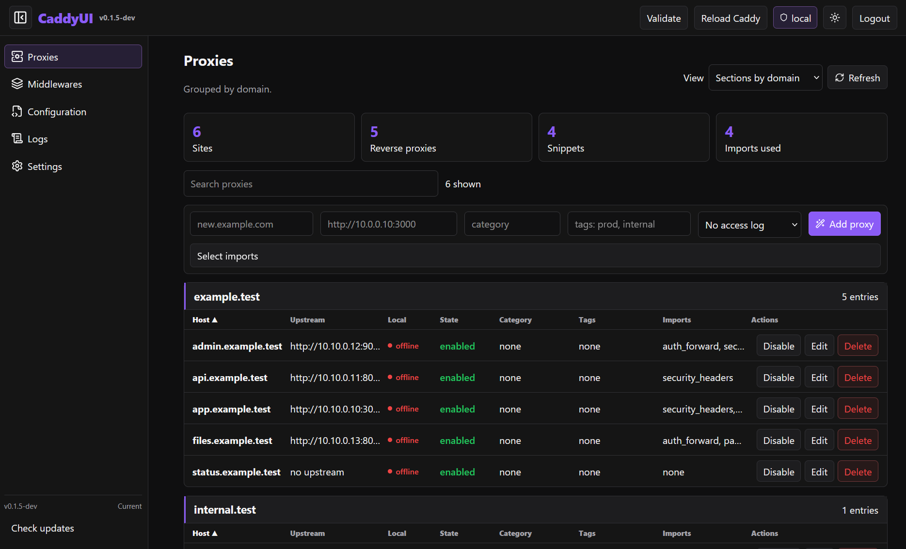

<!-- <p align="center">
  
</p> -->

# CaddyUI

```text
__| |___________________________________________________________| |__
__   ___________________________________________________________   __
  | |                                                           | |  
  | |                                                           | |  
  | |    ██████╗ █████╗ ██████╗ ██████╗ ██╗   ██╗██╗   ██╗██╗   | |  
  | |   ██╔════╝██╔══██╗██╔══██╗██╔══██╗╚██╗ ██╔╝██║   ██║██║   | |  
  | |   ██║     ███████║██║  ██║██║  ██║ ╚████╔╝ ██║   ██║██║   | |  
  | |   ██║     ██╔══██║██║  ██║██║  ██║  ╚██╔╝  ██║   ██║██║   | |  
  | |   ╚██████╗██║  ██║██████╔╝██████╔╝   ██║   ╚██████╔╝██║   | |  
  | |    ╚═════╝╚═╝  ╚═╝╚═════╝ ╚═════╝    ╚═╝    ╚═════╝ ╚═╝   | |  
  | |                                                           | |  
__| |___________________________________________________________| |__
__   ___________________________________________________________   __
  | |                                                           | |          
```

A friendly web UI for managing your Caddyfile, proxies, snippets, logs, users, and updates.

Because editing reverse proxy configs by hand is fun right up until it is not.

[](https://github.com/DrB0rk/CaddyUI/releases/latest)
[](https://github.com/DrB0rk/CaddyUI/releases)
[](https://github.com/DrB0rk/CaddyUI/commits)
[](https://github.com/DrB0rk/CaddyUI/stargazers)

## Active development warning

CaddyUI is under active development. Things move quickly, and some parts may still change between versions.

Release channels:

- `main` is the stable release lane
- `beta` is for pre-release testing
- `dev` gets the newest changes first and may be less predictable

Use `stable` if you want the calm path. Use `beta` or `dev` if you want newer features and do not mind the occasional sharp edge.

## Quick install

### Stable

```bash
curl -fsSL https://raw.githubusercontent.com/DrB0rk/CaddyUI/main/scripts/install.sh | bash
```

### Beta

```bash
curl -fsSL https://raw.githubusercontent.com/DrB0rk/CaddyUI/beta/scripts/install.sh | bash
```

### Dev

```bash
curl -fsSL https://raw.githubusercontent.com/DrB0rk/CaddyUI/dev/scripts/install.sh | bash
```

When the installer finishes, it prints your onboarding URL.

Run the same command again later to update CaddyUI.

> Beta and dev builds may show `-dev` style app versions. That is expected.

## What you get

- Manage reverse proxies from the UI
- Add, edit, enable, disable, and delete proxy entries
- Create and manage Caddy snippets/middlewares
- Monaco-powered editors for raw config and entries
- Validate your config with `caddy validate`
- Reload Caddy after changes
- View logs from files and `journalctl`
- Built-in user authentication
- Role-based access: `view`, `edit`, and `admin`
- Security settings: trusted proxy hops, cookie mode, setup exposure, allowed origins
- Onboarding with Caddyfile and log discovery
- Self-updates from `stable`, `beta`, or `dev`

## How it works

CaddyUI reads your configured `Caddyfile`, parses your sites, proxies, and imports, then shows them in a web interface.

When you make a change, CaddyUI writes it back to the `Caddyfile`, validates the result with `caddy validate`, and can reload Caddy for you.

It also handles onboarding, authentication, user roles, log discovery, update channel selection, and runtime security settings.

## Looks like this

<p align="center">
  
</p>

## Onboarding

The first-time setup walks you through:

1. Creating an admin user
2. Entering the setup token, if required
3. Selecting a detected Caddyfile or entering a path manually
4. Selecting detected log files or adding log paths manually

## Security note

- In production (`NODE_ENV=production`), set `CADDY_UI_SECRET` to a strong value (at least 32 characters), or the server will refuse to start.

## UI pages

- **Proxies**  
  Manage proxy entries with grouping, search, sorting, imports, logging, tags, and categories.

- **Middlewares**  
  Create, edit, and delete reusable Caddy snippets.

- **Configuration**  
  Edit the full raw Caddyfile directly.

- **Logs**  
  View Caddy logs from configured files and `journalctl`.

- **Settings**  
  Configure paths, scans, users, passwords, update channel, and security options.

## Reverse proxy example

```caddyfile
caddyui.example.com {
    reverse_proxy 127.0.0.1:8787
}
```

## Links

- Repo: https://github.com/DrB0rk/CaddyUI
- Releases: https://github.com/DrB0rk/CaddyUI/releases
- Issues: https://github.com/DrB0rk/CaddyUI/issues
- Security policy: https://github.com/DrB0rk/CaddyUI/blob/main/docs/SECURITY.md
- Contributing: https://github.com/DrB0rk/CaddyUI/blob/main/docs/CONTRIBUTING.md
- Stable installer: https://raw.githubusercontent.com/DrB0rk/CaddyUI/main/scripts/install.sh
- Beta installer: https://raw.githubusercontent.com/DrB0rk/CaddyUI/beta/scripts/install.sh
- Dev installer: https://raw.githubusercontent.com/DrB0rk/CaddyUI/dev/scripts/install.sh

## Uninstall

```bash
curl -fsSL https://raw.githubusercontent.com/DrB0rk/CaddyUI/main/scripts/uninstall.sh | bash
```

## Reset onboarding

```bash
sudo rm -rf /var/lib/caddyui
sudo systemctl restart caddyui
```
